# 1. Create database named: FacultySystemDB.
# 2. Create collection (student) that has:
	● FirstName: string, LastName: string, Age: Number, Faculty: An object that
	has Name and Address
	● Grades: An array of objects, each object has: CourseName, Grade, Pass
	(Boolean).
	● IsFired: Boolean
 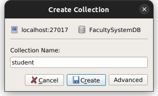
 

# 3. Insert 3 (at least) documents in Student collection with different values.
	● Try inserting one record each time
	● Try inserting many students using one insert statement.
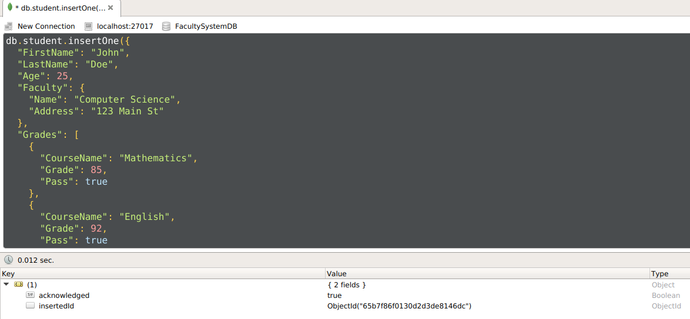
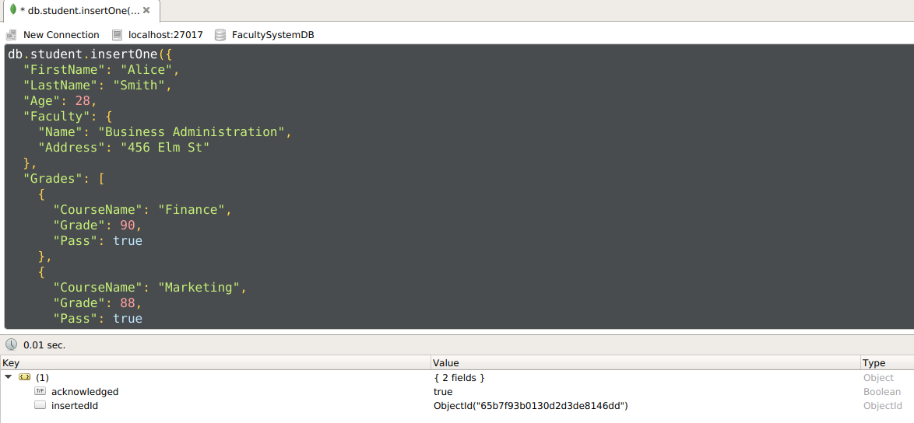
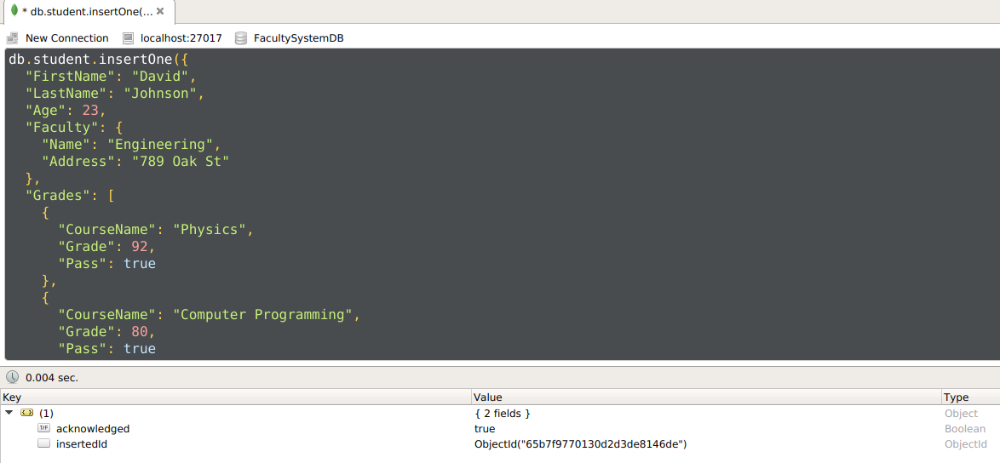

# 5. Update the student with specific FirstName, and change his LastName.

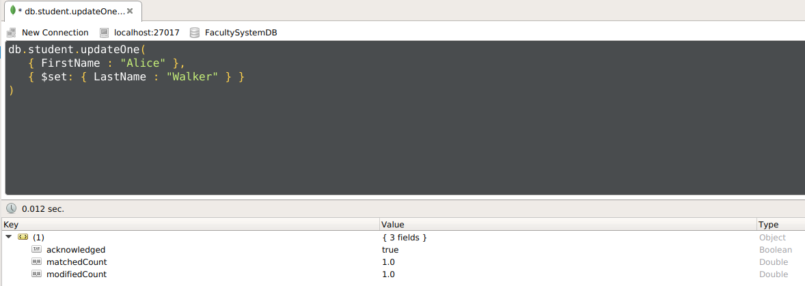

# 6. Retrieve the following data:
	● All Students.
	● Student with specific First Name.
	● Students who his First Name=Ahmed, or Last Name= Ahmed.
	● Students that their First name isn't "Ahmed".
	● Students with Age more than or equal to 21, and their faculty isn't NULL.
	● Display student with specific First Name, and display his First Name, 
	  Last name, IsFired fields only.
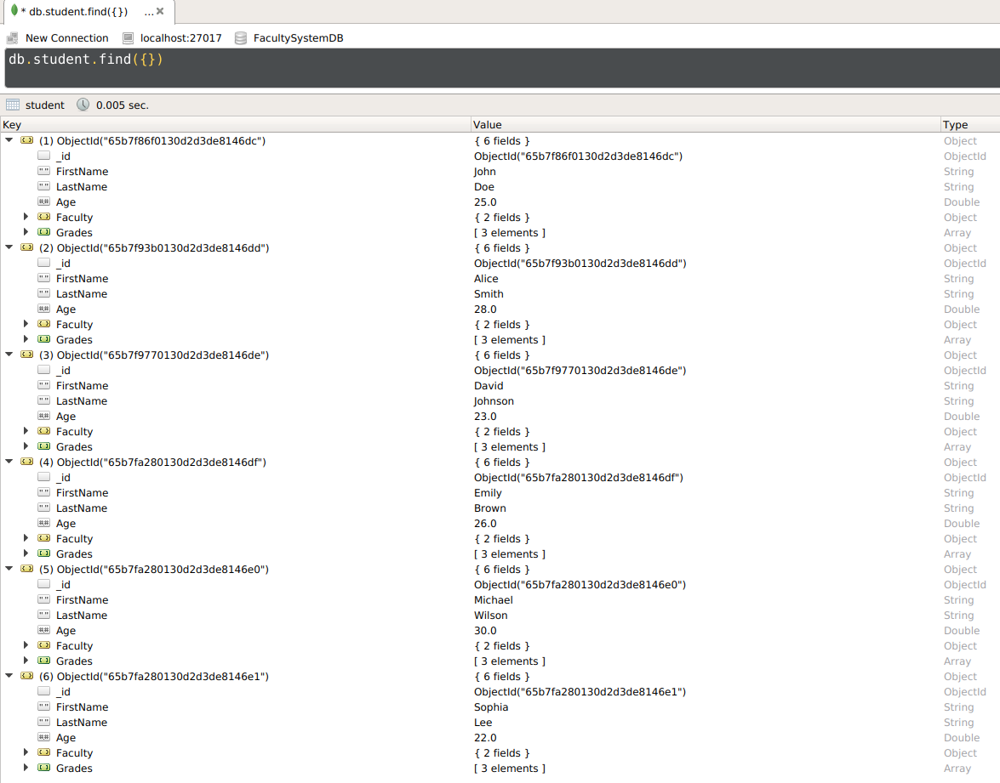
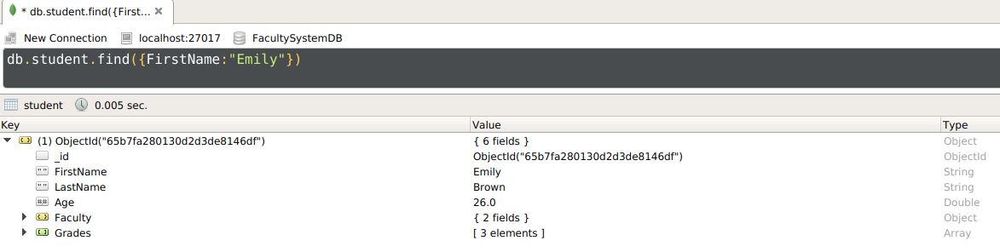
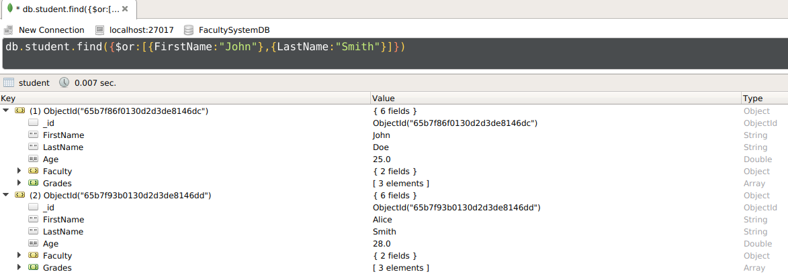
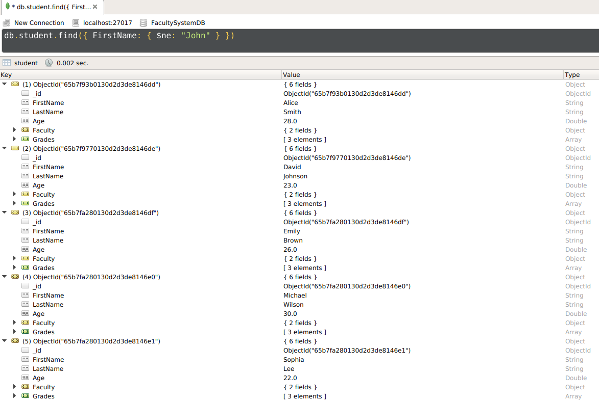
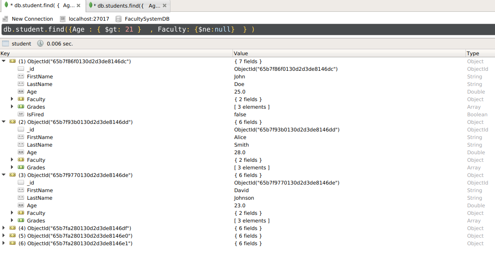
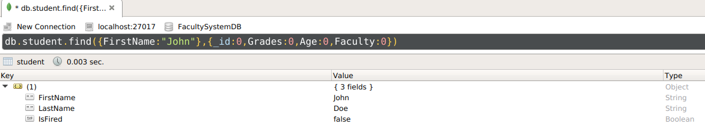

# 7. Delete Fired students.
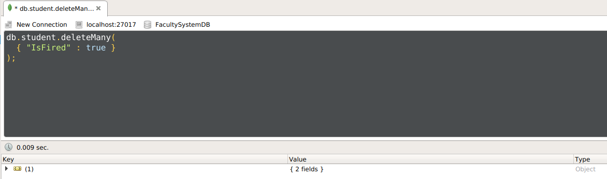

8. Delete all students collection.
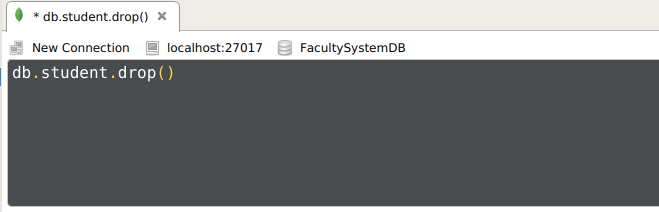

9. Delete the whole DB.
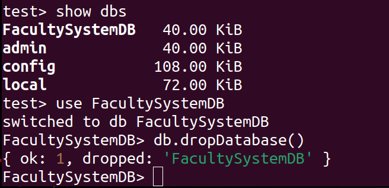
