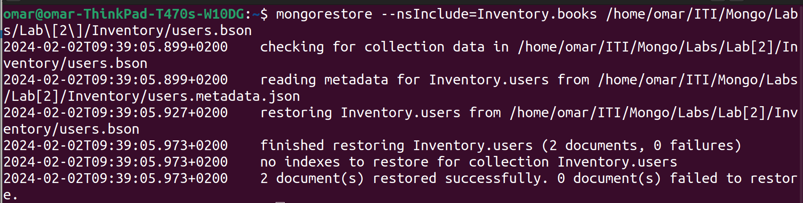
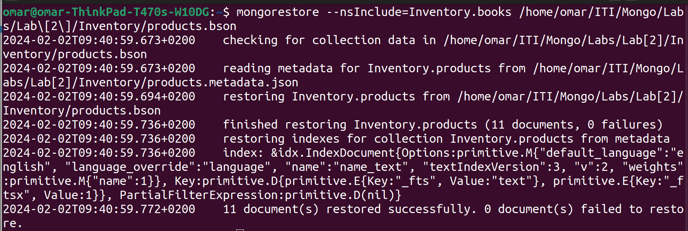
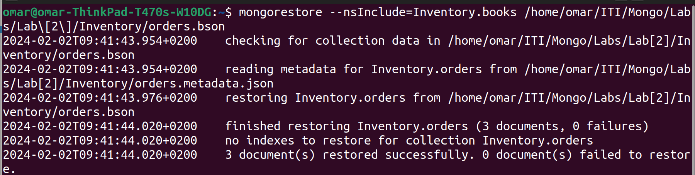
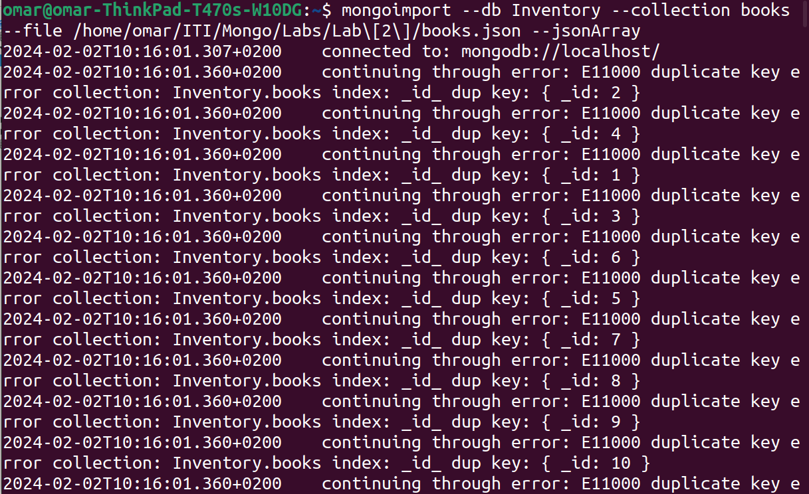
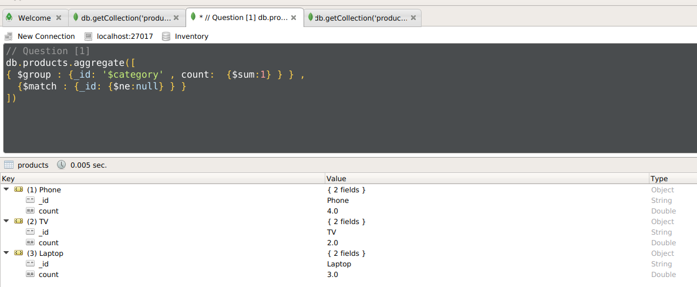
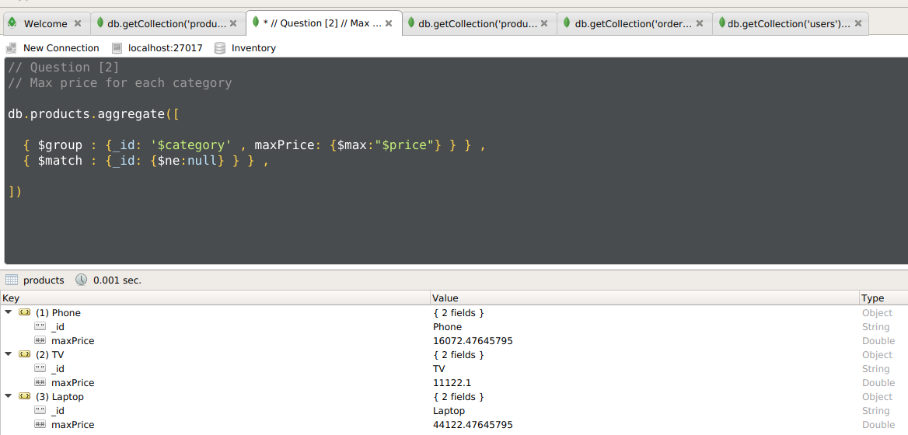
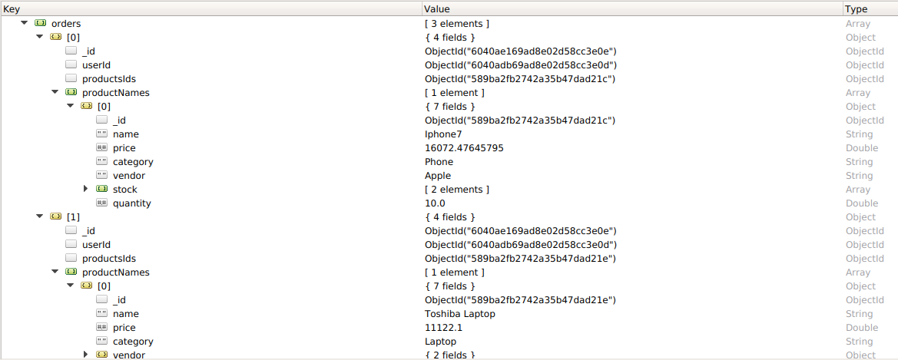

## Import inventory database

## Import books collection

## Display number of products per category.

## Display max category products price.

## Display user ahmed orders populated with product.

