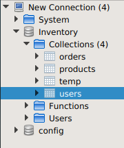

## Import inventory database

## Import books collection

## Result 

## Display number of products per category.

## Display max category products price.

## Display user ahmed orders populated with product.

### Query
db.users.aggregate([
  {
    $match: {
      name: "ahmed"
    }
  },
  {
    $lookup: {
      from: "orders",
      localField: "_id",
      foreignField: "userId",
      as: "UserOrder"
    }
  },
  {
    $unwind: "$UserOrder"
  },
  {
    $unwind: "$UserOrder.productsIds"
  },
  {
    $lookup: {
      from: "products",
      localField: "UserOrder.productsIds",
      foreignField: "_id",
      as: "UserOrder.productNames"
    }
  },
  {
    $group: {
      _id: "$_id",
      name: { $first: "$name" },
      orders: { $push: "$UserOrder" } ,
    }
  },

  
])

### Result

